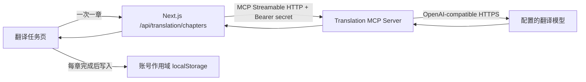

# Stray Pages MCP 真实翻译接入设计

## 目标

在保留当前本地 TXT、账号隔离和浏览器持久化架构的前提下，将“创建译本”从确定性的演示译文升级为真实翻译：Next.js 服务端作为 MCP Client，调用仓库内独立运行的 Streamable HTTP MCP Server；MCP Server 再调用由环境变量配置的 OpenAI 兼容 Chat Completions 接口。

第一版按章节顺序执行。页面关闭时不在后台继续；已完成章节立即保存，失败章节可单独重试，刷新后不自动重复一个状态未知的模型请求。

## 非目标

- 不在本阶段接入 PostgreSQL、Supabase Auth、对象存储或生产任务队列。
- 不实现浏览器关闭后仍持续执行的后台翻译。
- 不实现真实余额冻结、扣款或供应商账单结算。
- 不把模型 API Key、MCP 共享密钥或 MCP 服务地址暴露给浏览器。
- 不在 MCP 不可用时静默回退到 Fake Provider 或模板译文。
- 不实现联网检索；现有 `webLookupEnabled` 在本阶段继续保持关闭。

## 方案比较与决策

### 方案 A：独立 Streamable HTTP MCP Server（采用）

Next.js Route Handler 使用官方 MCP SDK 连接独立 HTTP MCP 服务。MCP 服务封装 OpenAI 兼容接口，既可以和网站部署在同一主机，也可以单独部署。

优点：进程边界清晰；密钥隔离；符合用户选择的“项目调用外部 MCP”；后续可以替换模型厂商或让其他 MCP Client 复用。缺点：本地开发需要同时启动两个进程。

### 方案 B：Next.js 启动 stdio MCP 子进程

优点是本地启动简单，缺点是 Serverless 和多实例环境中生命周期脆弱，容易产生孤儿进程，扩缩容、健康检查和部署都不清晰。因此不采用。

### 方案 C：Next.js 直接调用 OpenAI 兼容接口

实现最少，但绕过 MCP，无法满足本次需求，也失去 MCP Tool 的可发现协议、独立测试和多客户端复用能力。因此不采用。

## 总体架构



### 进程职责

- 浏览器：选择章节、展示进度、按顺序触发章节翻译、保存每章结果、提供失败重试。
- Next.js Route Handler：验证会话与请求边界、调用 MCP、将 MCP 错误映射为稳定的用户侧错误，不持有浏览器数据。
- MCP Client：只存在于服务端模块，连接固定环境变量中的 MCP URL，调用 `translate_segments` 并验证返回结构。
- MCP Translation Provider：实现现有 `TranslationProvider` 接口，让 Route Handler 继续依赖项目已有 Provider 抽象，而不是直接依赖 SDK Client。
- MCP Server：验证 Tool 输入、鉴权、限制资源用量、并发调用 OpenAI 兼容模型、返回和源 segment 一一对应的结果。
- OpenAI 兼容 Provider：只负责 Chat Completions；厂商由 `AI_BASE_URL`、`AI_API_KEY`、`AI_MODEL` 决定。

## MCP Tool 契约

Tool 名称：`translate_segments`

用途描述：将一组有稳定 ID 的小说片段翻译为指定语言，返回相同 ID 和顺序的纯译文。单次最多 10 段，每段最多 1200 个 Unicode 字符，总字符数最多 12000；不执行检索，不返回解释。

输入：

```ts
type TranslateSegmentsInput = {
  requestId: string;
  sourceLanguage: string;
  targetLanguage: "中文" | "英文" | "日文" | "韩文" | "俄语" | "德语" | "西班牙语" | "法语";
  style: "自然";
  glossaryTerms: Array<{
    sourceTerm: string;
    targetTerm?: string;
    note?: string;
  }>;
  segments: Array<{
    id: string;
    index: number;
    chapterId: string;
    chapterTitle: string;
    text: string;
  }>;
};
```

成功输出：

```ts
type TranslateSegmentsOutput = {
  requestId: string;
  providerName: "openai-compatible";
  model: string;
  translations: Array<{
    segmentId: string;
    index: number;
    translatedText: string;
  }>;
  usage?: {
    inputTokens: number;
    outputTokens: number;
  };
};
```

MCP Tool 使用标准返回形状 `content: [{ type: "text", text: JSON.stringify(output) }]`；失败返回 `isError: true` 和不含上游敏感信息的 JSON 错误。Next.js MCP Client 必须解析并再次校验这段 JSON，不能信任 Tool 返回值。

模型调用采用“一段一次请求、最多 3 路并发”。这样不依赖厂商对 JSON Schema 或结构化输出的兼容程度，同时由服务器代码稳定地补回 `segmentId` 和 `index`。所有段落成功后 Tool 才返回成功；任何一段失败则整个 Tool 返回 `isError: true`，浏览器不会保存半章结果。

## 翻译提示词

MCP Server 为每个 segment 构造两条消息：

- system：要求专业小说翻译、保持情节与语气、遵守术语表、只输出译文、不输出说明或 Markdown 包裹。
- user：包含章节名、源语言、目标语言、风格、术语表和原文。

模型响应必须是非空文本。服务端只清除模型偶发添加的单层 Markdown 代码围栏，不执行会改变译文含义的清洗。

## 本地任务与存储模型

当前译本不再在创建时直接标记全部完成。创建动作生成队列记录：

```ts
type StoredLocalTranslationStatus = "queued" | "processing" | "ready" | "partial" | "failed";
type StoredLocalTranslationTaskStatus = "queued" | "translating" | "ready" | "failed";
```

每个任务增加：

- `attemptCount`：用户实际发起的尝试次数；
- `failureReason?`：脱敏、可操作的失败说明；
- `qualityStatus?`：`passed` 或 `needs-review`；
- `providerName?` 与 `model?`：用于诊断，不包含密钥或 URL；
- `updatedAt`。

创建译本时，选中章节先使用现有 `splitChapterIntoTranslationSegments` 切分。持久化章节的 `sourceParagraphs` 直接保存 segment 文本，保证译文数组可以按 index 与源文一一对应；`translatedParagraphs` 初始为空。

任务页一次只处理第一个 `queued` 任务：

1. 将任务原子式更新为 `translating` 并保存；
2. POST 一个章节到 Next.js Route Handler；
3. 成功后运行现有 `assessTranslationQuality`，写入译文、Provider 元数据和质量状态；
4. 失败时保存 `failed` 和稳定错误信息，不自动重试；
5. 完成后继续下一个 `queued` 任务；
6. 用户可以对 `failed` 任务点击“重试”。

若页面加载时发现遗留的 `translating`，将其改为 `failed`，提示“上次请求状态未知，请手动重试”。这比自动重发更安全，可避免刷新时对模型产生不可见的重复调用。

译本汇总规则：

- 全部任务 `ready` → `ready`；
- 有成功也有失败 → `partial`；
- 全部失败且没有等待任务 → `failed`；
- 存在 `translating` → `processing`；
- 其余存在 `queued` → `queued`。

只有至少一个章节完成时才启用阅读器；阅读器只展示已有译文章节。

## Next.js 服务端 API

路由：`POST /api/translation/chapters`

请求只接受一个章节及其 segments、目标语言、风格和术语表。Route Handler 必须：

1. 使用当前会话机制拒绝未登录请求；
2. 检查 JSON Content-Type、请求体形状、每段和总字符上限；
3. 检查 `Origin` 与 `NEXT_PUBLIC_APP_URL` 同源，减少跨站滥用；
4. 使用进程内按用户作用域的并发锁，单个用户最多一个活动章节请求；
5. 从服务端环境变量读取 MCP URL 和共享密钥；
6. 为 MCP 调用设置 180 秒总超时，并始终在 `finally` 中关闭 Client/Transport；
7. 验证 MCP 输出数量、ID、index 和非空译文；
8. 返回稳定 JSON，不将上游响应体、堆栈、API Key、MCP secret 或内部 URL返回浏览器。

进程内并发锁只是本地原型保护，不声称等价于生产级分布式限流。未来多实例部署需替换为 Redis 或数据库锁。

能力探测路由：`GET /api/translation/capabilities`

- 要求有效会话；
- 只返回 `{ configured, available, message }`；
- `configured` 表示 Next.js 侧 MCP URL 与 secret 已设置；
- `available` 通过 MCP Server `/health` 的 2 秒超时探测获得；
- 不返回 MCP URL、模型名、Provider base URL 或任何 secret；
- 创建页用该结果决定是否启用真实翻译按钮。

## MCP Server HTTP 边界

- `POST /mcp`：MCP Streamable HTTP transport；要求 `Authorization: Bearer <MCP_TRANSLATION_SECRET>`。
- `GET /health`：只返回服务状态和是否已完成配置校验，不返回模型、URL或密钥。
- 其他路径返回 404；不启用浏览器 CORS。
- 请求体上限 256 KB；请求与模型调用都有 AbortController 超时。
- 启动时验证环境变量，缺失时输出到 stderr 并以非零状态退出。
- stdio 协议流规则同样遵守：运行日志只写 stderr，不用 stdout 打印调试内容。

## OpenAI 兼容配置

新增服务端环境变量：

```dotenv
TRANSLATION_MCP_URL=http://127.0.0.1:8787/mcp
TRANSLATION_MCP_SECRET=replace-with-a-long-random-secret
MCP_TRANSLATION_PORT=8787
AI_BASE_URL=https://api.openai.com/v1
AI_API_KEY=
AI_MODEL=
AI_REQUEST_TIMEOUT_MS=60000
```

`AI_BASE_URL` 在 MCP Server 内规范化为不带尾部 `/`，调用 `${AI_BASE_URL}/chat/completions`。所有变量均为服务端变量，不使用 `NEXT_PUBLIC_` 前缀。示例文件只放空值或明显占位符。

## 错误模型

内部错误代码：

- `AUTH_REQUIRED`：网站会话无效；HTTP 401。
- `ORIGIN_REJECTED`：来源不可信；HTTP 403。
- `INVALID_INPUT`：请求超过限制或结构错误；HTTP 400。
- `TRANSLATION_BUSY`：同一账号已有活动请求；HTTP 409。
- `MCP_NOT_CONFIGURED`：网站缺少 MCP 配置；HTTP 503。
- `MCP_UNAVAILABLE`：连接失败或 MCP 协议错误；HTTP 503。
- `PROVIDER_RATE_LIMITED`：模型服务限流；HTTP 429。
- `PROVIDER_TIMEOUT`：模型服务超时；HTTP 504。
- `PROVIDER_RESPONSE_INVALID`：模型返回空内容或协议结构错误；HTTP 502。
- `TRANSLATION_FAILED`：其他已脱敏失败；HTTP 502。

浏览器保存面向用户的中文消息和代码，不保存上游原始响应。失败不会覆盖此前成功章节，也不会将整个译本误标为完成。

## 依赖与脚本

根项目增加并精确固定：

- `@modelcontextprotocol/sdk`：MCP Server 与 Client；
- `zod`：Tool、HTTP 请求和环境变量校验；
- `tsx`：本地启动 TypeScript MCP Server；
- `tsup`：生成生产 ESM bundle。

新增脚本：

- `mcp:translation:dev`：开发模式启动 MCP Server；
- `mcp:translation:build`：构建独立服务；
- `mcp:translation:start`：运行构建产物；
- `dev:all`：并行启动 MCP Server 与 Next.js；如果不增加进程管理依赖，则 README 提供两个终端的明确命令，不实现该脚本。

所有版本使用精确 SemVer，lockfile 同步更新。

## 测试设计

### 纯逻辑测试

- MCP Tool 输入边界：空段、超长段、超过 10 段、总字符超限、非法目标语言。
- OpenAI 兼容响应：成功、空 choices、空 content、HTTP 401/429/500、超时。
- 段落并发映射：无论完成顺序如何，结果按 input index 排序并保留 ID。
- 本地译本状态：queued → translating → ready；失败与手动重试；部分完成；刷新遗留 translating。
- 损坏 localStorage 数据继续阻断写入。

### Next.js API 测试

- 未登录、跨站 Origin、非法输入、并发冲突、MCP 未配置。
- 注入 Fake MCP Gateway 验证成功映射和错误脱敏。
- MCP 返回重复 ID、缺失 ID、额外 ID、空译文时拒绝结果。

### MCP 协议集成测试

- 使用 SDK Client 连接测试 HTTP Server，列出 `translate_segments` Tool 并完成一次调用。
- Bearer secret 缺失或错误时拒绝。
- 用注入的 Fake OpenAI Gateway 测试，不在自动化测试中访问真实网络。

### UI 与浏览器回归

- 创建译本后初始为等待状态，不出现模板译文。
- 任务页按章运行并实时刷新进度。
- 失败章节显示原因和重试按钮；成功章节刷新后保留。
- MCP 未启动时显示可恢复错误，不回退演示内容。
- 完成后阅读器显示真实返回译文。

### 完整门禁

```powershell
node --experimental-strip-types --test tests/*.test.ts
node node_modules/eslint/bin/eslint.js .
node node_modules/typescript/bin/tsc --noEmit --incremental false
pnpm mcp:translation:build
node node_modules/next/dist/bin/next build
git diff --check
```

## 可观测性与隐私

- 日志只记录 requestId、segment 数量、字符数、耗时、状态码和错误代码。
- 不记录原文、译文、术语表、Cookie、API Key 或共享密钥。
- MCP 返回 usage 时可写入已有内部成本账本，但本阶段不显示真实扣费，也不据此修改用户余额。
- 用户界面明确说明模型翻译会把选中的章节发送到配置的第三方模型服务。

## 文案与能力边界

- MCP 配置完整时，创建页显示“通过已配置的 MCP 翻译服务生成译文”。
- MCP 未配置或健康检查失败时，禁用开始按钮并显示启动与配置提示。
- 首页将“真实 AI 翻译仍待接入”改为“真实翻译需要配置 MCP 与模型服务”；默认无配置时不宣称可用。
- 费用区域继续标记为演示，不将模型调用误称为真实计费。

## 完成标准

1. 本地启动 MCP Server 与 Next.js 后，用户可选择章节并获得真实 OpenAI 兼容模型译文。
2. 浏览器和 Next.js 客户端包中不存在模型 API Key 或 MCP secret。
3. 每章成功即持久化；失败不覆盖成功内容；手动重试可恢复。
4. MCP 停止、模型超时、限流、无效响应均有明确且脱敏的错误状态。
5. 自动化测试、MCP bundle、Next.js production build 和浏览器回归全部通过。
